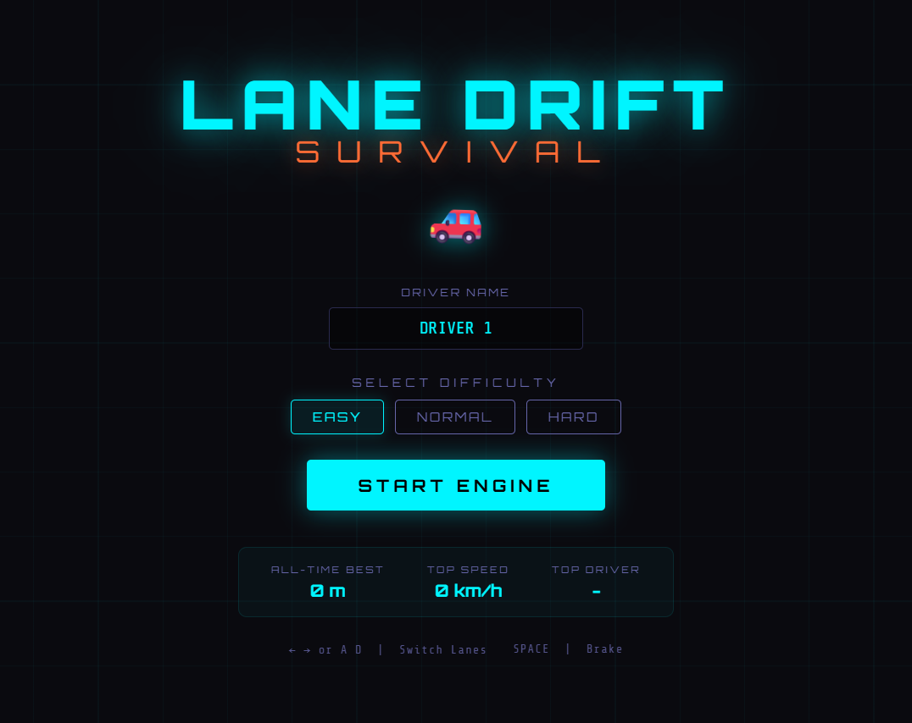

# Lane Drift Survival 🚗

**Lane Drift Survival** is an endless, fast-paced arcade driving game built entirely with Vanilla JavaScript, HTML5 Canvas, and CSS. Avoid incoming traffic, manage your speed, and adapt to rapidly changing weather conditions in this test of reflexes and endurance!



---

## 🕹️ Play the Game

The game is hosted and fully playable directly in your browser:
**➡️ [Play Lane Drift Survival Here](avi511.github.io/Lane-Drift-Survival/) ⬅️**

---

## ✨ Features

* **Physics-Based Handling**: Experience smooth, lateral momentum and realistic body roll rather than rigid, grid-based lane snapping.
* **Dynamic Weather System**: The environment seamlessly shifts between Clear skies, Rain, Snow, and Heavy Fog. Weather isn't just visual; rain makes the road slippery, and fog obscures incoming traffic.
* **Procedural Audio Engine**: Utilizing the Web Audio API, the game generates dynamic engine hums, wind noise, and sound effects entirely through code—no external `.mp3` files required!
* **Advanced Canvas Rendering**: Enjoy realistic visual elements including soft drop shadows, pseudo-3D car volumes via gradients, dynamic lighting (glowing tail lights), and particle systems for exhaust smoke and collision sparks.
* **Career Tracking**: The game securely saves your **All-Time Best Distance**, **Top Speed**, and **Custom Driver Name** locally in your browser.
* **Multiple Difficulties**: Choose between Easy, Normal, or Hard to match your skill level.

---

## 🎮 How to Play

* **Steer Left/Right**: Use the `Left Arrow`/`Right Arrow` keys or `A`/`D`. Consecutive presses will queue up smooth, multi-lane drifts.
* **Brake**: Hold the `SPACEBAR` to slow down and avoid immediate collisions. (Watch out for the brake smoke!)
* **Pause**: Press `ESC` at any time to pause the action.

**The Goal**: Survive as long as possible without losing all your health/lives to oncoming traffic. Your distance accumulates faster the longer you survive without braking!

---

## 🛠️ Architecture & Under the Hood

The game is structured into modular JavaScript components for clean, maintainable code:

* **`index.html`**: The UI skeleton, menu layouts, and canvas container.
* **`css/style.css`**: The neon-infused styling, animations, and glassmorphism UI effects.
* **`js/game.js`**: The core game loop (running at 60 FPS), state machine, and local storage management.
* **`js/renderer.js`**: The visual engine that handles drawing the road, cars, shadows, and particles directly to the HTML5 Canvas.
* **`js/player.js`**: Calculates the lateral physics, steering angles, body roll, and damage handling for the player's car.
* **`js/traffic.js`**: The AI system that spawns and manages the descending obstacle cars based on difficulty.
* **`js/weather.js`**: Controls environmental transitions and draws precipitation/fog overlays.
* **`js/audio.js`**: The custom synthesizer for engine noise and sound effects using the `AudioContext` API.
* **`js/ui.js`**: Manages interactive UI states, specifically the Pause menu and Escape key bindings.
* **`js/utils.js`**: A library of generic math, interpolation (`lerp`), and color manipulation functions.

---

## 🚀 Running Locally

No build tools or servers are required to run this game locally!

1. Clone this repository:
   ```bash
   git clone https://github.com/Avi511/Lane-Drift-Survival.git
   ```
2. Open the directory:
   ```bash
   cd Lane-Drift-Survival
   ```
3. Open `index.html` directly in your favorite modern web browser.
 *Alternatively, use an extension like VS Code Live Server or run `npx serve .` to host it on `localhost`.*

---

## 👨‍💻 Author

Created by [Avi511](https://github.com/Avi511)

*If you enjoyed the game, feel free to star the repository!*
